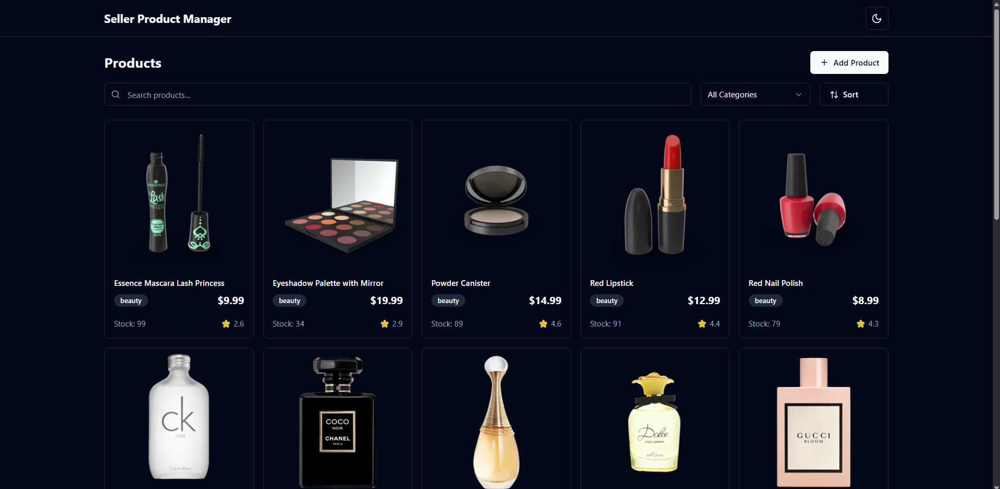
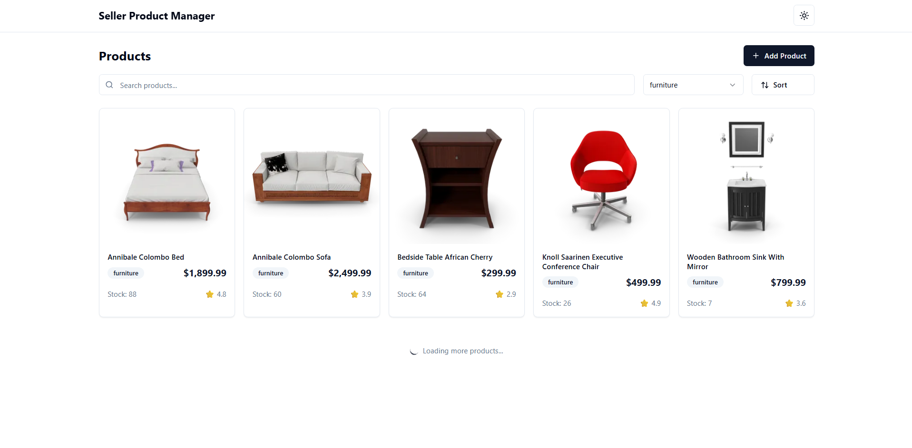
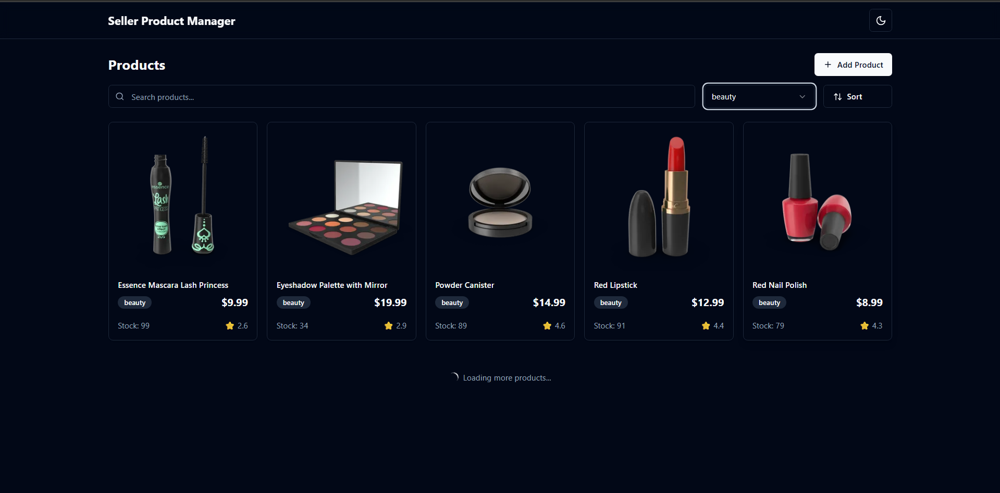

# Seller Product Manager

A modern, responsive React + TypeScript application for managing seller products with infinite scroll, search, filtering, and local product management.

## 🚀 Features

- **Product Display**: Fetches products from DummyJSON API with infinite scroll
- **Add Products**: Modal form to add new products locally with image upload
- **Search & Filter**: Real-time search by title and filter by category
- **Sort Options**: Sort by price (ascending/descending) and name (A-Z/Z-A)
- **Local Storage**: Persists locally added products using localforage
- **Dark/Light Theme**: Toggle between themes with system preference support
- **Responsive Design**: Works seamlessly on desktop, tablet, and mobile
- **Loading States**: Skeleton loaders and intersection observer for smooth UX

## 🛠️ Tech Stack

- **React 18** with TypeScript
- **Vite** for fast development and building
- **TailwindCSS** for styling
- **Radix UI** for UI components 
- **Zustand** for state management
- **React Hook Form + Zod** for forms and validation
- **Sonner** for toast notifications
- **LocalStorage** for persistent storage
- **Lucide React** for icons

## 📁 Project Structure

```
src/
├── components/          # Reusable UI components
│   ├── ui/             # shadcn/ui components
│   ├── navbar.tsx      # Navigation bar
│   ├── theme-provider.tsx
│   └── theme-toggle.tsx
├── features/product/    # Product-related components
│   ├── product-card.tsx
│   ├── product-grid.tsx
│   ├── product-filters.tsx
│   ├── product-skeleton.tsx
│   └── add-product-modal.tsx
├── hooks/              # Custom React hooks
│   ├── use-products.ts
│   └── use-intersection-observer.ts
├── lib/                # Utility functions
│   ├── utils.ts
│   └── storage.ts
├── pages/              # Page components
│   └── products-page.tsx
├── store/              # Zustand store
│   └── product-store.ts
├── types/              # TypeScript type definitions
│   └── product.ts
├── App.tsx
├── main.tsx
└── index.css
```

## 🚦 Getting Started

### Prerequisites

- Node.js 18+ 
- npm or yarn

### Installation

1. Clone the repository:
```bash
git clone <repository-url>
cd seller-product-manager
```

2. Install dependencies:
```bash
npm install
```

3. Start the development server:
```bash
npm run dev
```

4. Open your browser and navigate to `http://localhost:5173`

### Build for Production

```bash
npm run build
```


## 🎯 Key Features Explained

### Infinite Scroll
- Uses Intersection Observer API for efficient loading
- Loads 10 products per request from DummyJSON API
- Smooth loading experience with skeleton components

### Local Product Management
- Add new products with form validation using Zod
- Image upload with FileReader for preview
- Products marked with "New" badge
- Persistent storage using localforage

### Search and Filtering
- Real-time search by product title
- Category-based filtering
- Multiple sort options (price, name)
- Responsive filter controls

### State Management
- Zustand store for global state
- Computed selectors for filtered products
- Persistent local products across sessions

### Theme Support
- Light/Dark/System theme modes
- Persistent theme preference
- Smooth theme transitions


### Modifying API Endpoint
Update the API URL in `src/hooks/use-products.ts`:

```typescript
const API_BASE_URL = 'https://your-api-endpoint.com/products';
```


## 📱 Screenshots

The application features:
- Clean, modern interface with card-based product display
- Responsive grid layout that adapts to screen size
- Intuitive search and filter controls
- Smooth dark/light theme transitions
- Loading states and empty states

Home Screen - Dark and Light

 

Add Products 

    

Sorting and Category

 
